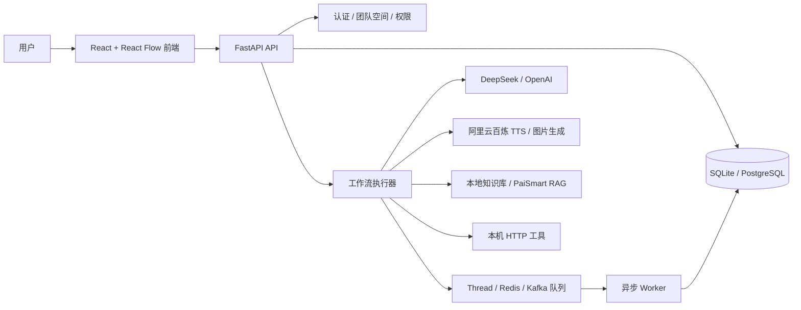
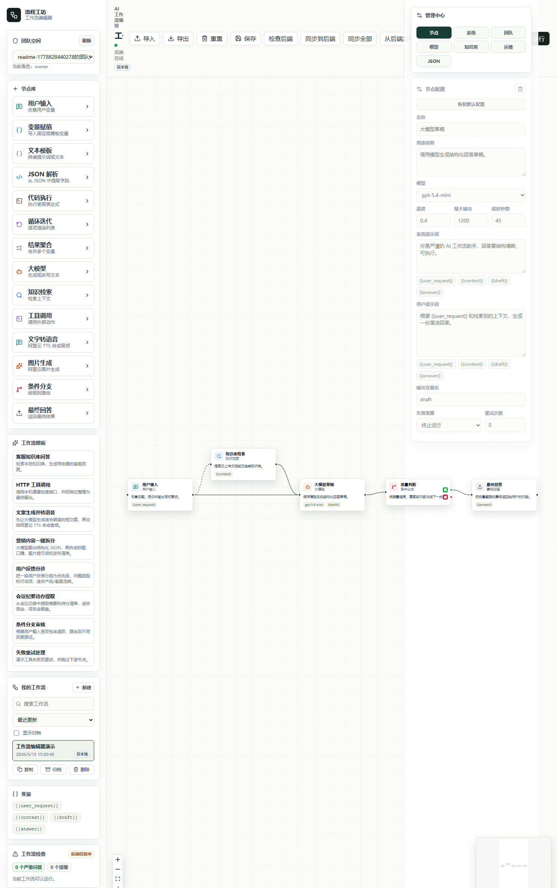
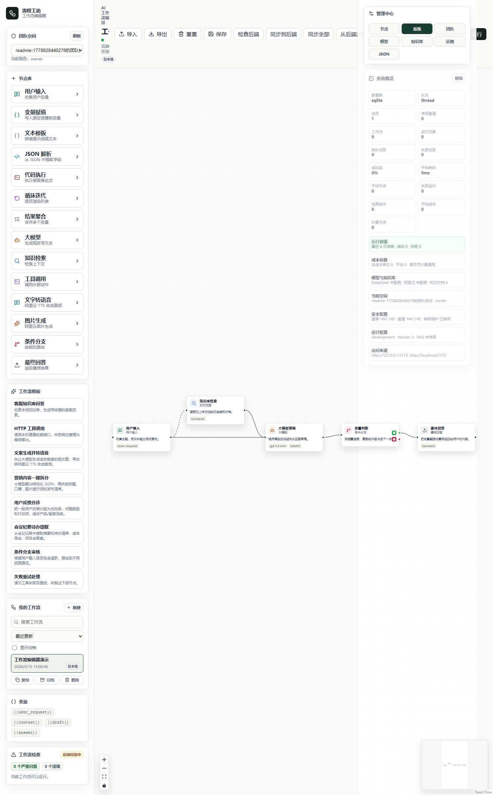
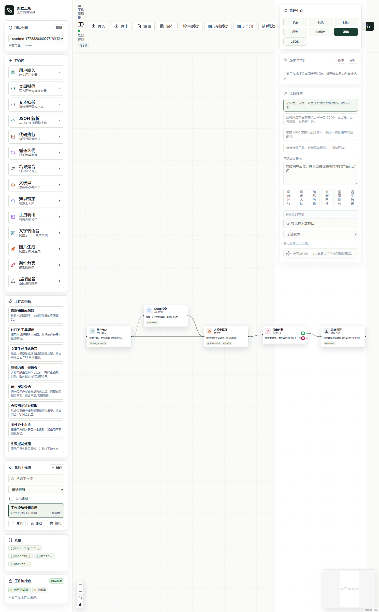
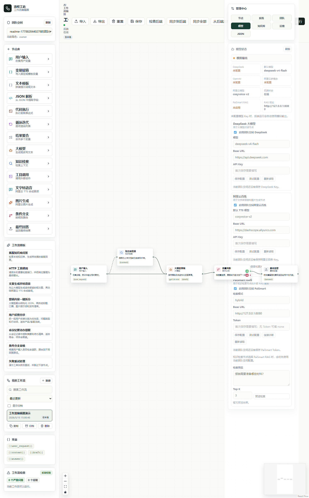

# 织流 AI / WeaveFlow AI

[](https://github.com/996963759/workflow-studio/actions/workflows/ci.yml)

织流 AI 是一个面向 AI 应用落地的可视化工作流编排平台。项目覆盖工作流画布、模型调用、RAG 知识检索、工具节点、异步队列、多用户团队空间、权限隔离、版本发布、审计日志、运行成本估算和 Docker Compose 部署。

## 5 分钟体验路线

1. 执行 `.\scripts\start-dev.ps1` 启动前端和后端。
2. 打开 `http://127.0.0.1:5173`，注册一个本地账号并登录。
3. 从左侧“工作流模板”创建“客服知识库问答”或“文案生成并转语音”。
4. 点击“同步到后端”，再点击“同步运行”或“异步入队”。
5. 在右侧查看逐节点运行日志、运行历史、版本审计和系统概览。
6. 可选：在“管理中心 -> 模型”保存 DeepSeek 或阿里云百炼 Key，体验真实模型调用。

## 项目亮点

- 可视化编排：基于 React Flow 实现节点拖拽、连线、变量传递、条件分支和运行日志。
- AI 应用能力：支持 DeepSeek、阿里云百炼 TTS/图片生成、PaiSmart 外部 RAG 和本地知识库检索。
- 后端工程化：FastAPI、SQLAlchemy、Alembic、Bearer Token、多用户隔离、团队空间和 owner/editor/viewer 权限。
- 稳定运行：支持同步运行、异步队列、失败重试、Kafka/Redis/数据库队列、运行历史和成本估算。
- 版本治理：支持工作流保存、发布态、历史版本、版本恢复、版本对比和审计日志。
- 可交付性：包含 unittest、Playwright E2E、Docker Compose、部署说明、API 文档和演示脚本。

## 技术栈

| 模块 | 技术 |
| --- | --- |
| 前端 | React 19, TypeScript, Vite, React Flow, lucide-react |
| 后端 | Python, FastAPI, Pydantic, SQLAlchemy, Alembic |
| 数据与队列 | SQLite, PostgreSQL, Redis, Kafka |
| AI 能力 | DeepSeek/OpenAI 兼容接口, 阿里云百炼/DashScope, PaiSmart RAG |
| 工程化 | Docker Compose, unittest, Playwright E2E, ESLint |

## 系统架构



## 核心能力

| 分类 | 能力 |
| --- | --- |
| 工作流编排 | 节点拖拽、连线执行、变量传递、条件分支、JSON 解析、循环、聚合、文本模板 |
| AI 节点 | 大模型对话、知识检索、文字转语音、图片生成、HTTP 工具调用 |
| 多用户协作 | 本地账号、团队空间、owner/editor/viewer 角色、成员管理、邀请码 |
| 持久化与治理 | 工作流 CRUD、归档恢复、发布态、版本快照、版本对比、审计日志 |
| 运行与评测 | 同步运行、异步入队、失败重试、运行历史、节点级输入输出、成本估算、关键词评测集 |
| 工程化 | SQLAlchemy、Alembic、Docker Compose、GitHub Actions、unittest、Playwright E2E |

## 内置场景模板

- 客服知识库问答：检索本地 Markdown/TXT 知识库，生成带依据的客服回复。
- 文案生成并转语音：大模型生成口播文案，再调用阿里云百炼 TTS 合成音频。
- 营销内容一键拆分：生成结构化 JSON，并拆分为标题、口播、图片提示词和发布清单。
- 用户反馈分诊：把用户反馈分类为优先级、问题类型和行动项。
- 会议纪要待办提取：从会议记录中提取摘要和待办清单。
- HTTP 工具调用 / 条件分支审核 / 失败重试处理：覆盖工具节点、分支路由和异常处理。

## 项目截图

> 截图位于 `docs/assets/screenshots/`，用于 GitHub README 和项目展示。

| 工作流画布 | 系统概览 |
| --- | --- |
|  |  |

| 版本审计 | 模型配置 |
| --- | --- |
|  |  |

## 文档导航

- [架构说明](docs/architecture.md)
- [API 摘要](docs/api.md)
- [用户教程](docs/user-guide.md)
- [演示流程](docs/demo-script.md)
- [演示录制说明](docs/demo-recording.md)
- [安全与边界](docs/security.md)
- [GitHub 发布检查清单](docs/github-release-checklist.md)
- [发布说明](docs/release-notes.md)
- [需求与计划](docs/requirements-and-plan.md)
- [成熟化部署说明](docs/production-readiness.md)

## 快速启动

推荐新手直接运行：

```powershell
.\scripts\start-dev.ps1
```

如果 PowerShell 提示禁止运行脚本，使用：

```powershell
powershell -ExecutionPolicy Bypass -File .\scripts\start-dev.ps1
```

脚本会检查依赖，启动后端和前端。启动后访问：

```text
http://127.0.0.1:5173
```

手动启动前端：

```powershell
npm.cmd install
npm.cmd run dev
```

完整操作说明见 [用户教程](docs/user-guide.md)。

## 环境变量

项目提供 `.env.example` 作为配置模板。常用项包括：

- `DEEPSEEK_API_KEY` / `OPENAI_API_KEY`：启用大模型节点。
- `DASHSCOPE_API_KEY`：启用阿里云百炼 TTS 和图片生成节点。
- `DATABASE_URL`：切换到 PostgreSQL 等数据库。
- `RUN_JOB_QUEUE_BACKEND`：异步队列模式，可选 `thread` / `database` / `redis` / `kafka`。
- `MODEL_CONFIG_SECRET`：保护团队空间级模型 API Key。

更多配置见 [用户教程](docs/user-guide.md#模型配置) 和 `.env.example`。

## Docker

```powershell
docker compose up --build
```

容器会启动 PostgreSQL、Redis、Kafka、FastAPI API 和独立 Worker。API 会自动执行 Alembic 迁移，异步任务会先落库再把 `job_id` 发布到 Kafka；如果 Worker 或服务重启，未完成任务会自动重新入队。Redis 仍保留为可选队列后端。

访问：

```text
http://127.0.0.1:8000
```

## 回归测试

推荐使用统一测试脚本：

```powershell
.\scripts\test-all.ps1
```

如果 PowerShell 提示禁止运行脚本，使用：

```powershell
powershell -ExecutionPolicy Bypass -File .\scripts\test-all.ps1
```

脚本会执行前端 lint、前端构建、Python 编译、后端 unittest，并启动临时后端运行 smoke test。

更多测试和体检命令见 [用户教程](docs/user-guide.md#测试和体检)。

## 当前边界

这是本地单机版 / 私有化版工作流平台雏形。当前前端运行逻辑已支持变量传递和模拟执行；后端已提供 FastAPI、SQLite/PostgreSQL 工作流 CRUD、工作流结构校验、同步/异步运行、运行历史接口、本地向量知识库检索、DeepSeek / OpenAI 大模型节点最小真实调用、阿里云 TTS / 图片生成多模态节点、本机 HTTP 工具调用、本地账号隔离、团队空间和角色权限。Docker Compose 已提供 PostgreSQL、Redis 和独立 Worker 的生产化雏形；真实 embedding/pgvector 和外网工具白名单管理仍未实现。

## 需求与计划

详细需求、MVP 边界和后续迭代计划见：

```text
docs/requirements-and-plan.md
```
