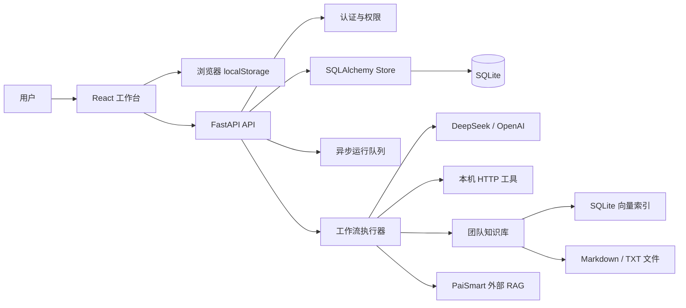
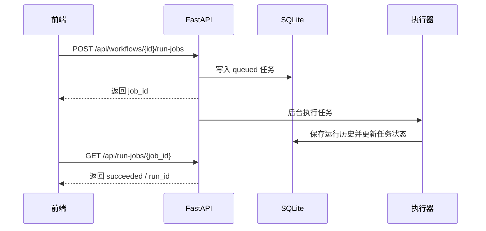

# 架构说明

## 总览

## 前端

- React + TypeScript + Vite。
- React Flow 负责画布、节点和连线。
- `localStorage` 保存本地草稿、当前工作流和登录 token。
- 前端运行器支持变量传递、条件分支和模拟执行。
- 后端同步状态分为：仅本地、已同步、未同步改动。

## 后端

- FastAPI 提供 API。
- SQLAlchemy ORM 管理 `users`、`sessions`、`workspaces`、`workspace_members`、`workflows`、`runs`、`run_jobs`、`knowledge_chunks`。
- Alembic 管理数据库迁移。
- Bearer Token 鉴权。
- 工作流、运行历史、知识库文件按团队空间隔离，并通过 owner/editor/viewer 角色控制读写。
- 异步运行队列使用进程内线程池，适合本地和简历演示；生产环境可替换为 Redis/Celery。
- 知识库使用 Markdown/TXT 文件保存原文，同时在 SQLite 中保存哈希向量索引，检索时混合关键词分和余弦相似度。
- 知识检索节点也可以选择 PaiSmart 外部 RAG，后端通过 `/api/v1/search/hybrid` 拉取检索片段；失败时回退本地知识库。

## 执行链路

同步运行仍保留：

## 数据隔离

- 每个账号有独立 `user_id`。
- 每个账号会自动创建默认团队空间。
- API 通过 `X-Workspace-Id` 选择空间；不传时使用默认空间。
- owner 可以管理成员，editor 可以编辑工作流和知识库，viewer 可以查看和运行。
- 工作流、运行历史、异步任务、知识库索引都绑定 `workspace_id`。

## 设计取舍

- 当前使用 SQLite，适合本地和演示；生产可迁移到 PostgreSQL。
- 当前向量索引是本地哈希向量，优点是零额外依赖；生产可升级到真实 embedding + pgvector/Milvus。
- 当前异步队列是单进程内存队列，适合本地；多实例部署需要外部队列。
