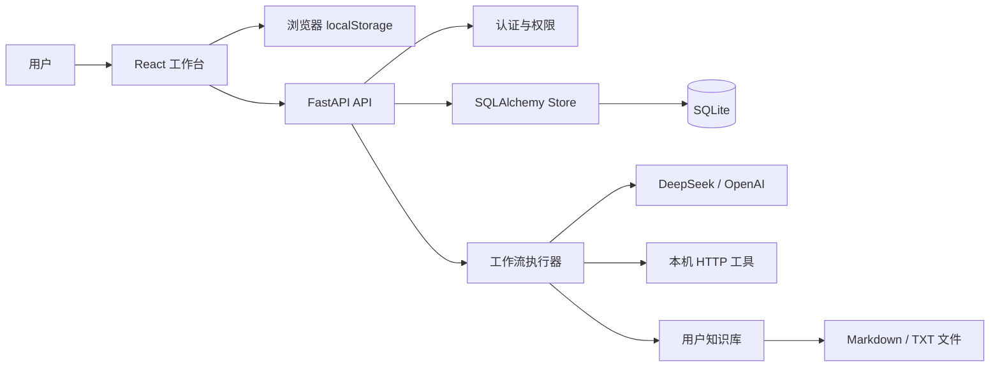
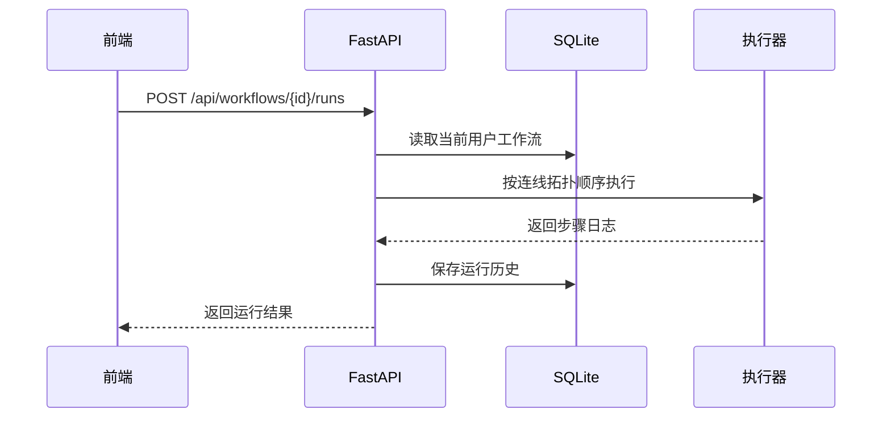

# 架构说明

## 总览

## 前端

- React + TypeScript + Vite。
- React Flow 负责画布、节点和连线。
- `localStorage` 保存本地草稿、当前工作流和登录 token。
- 前端运行器支持变量传递、条件分支和模拟执行。
- 后端同步状态分为：仅本地、已同步、未同步改动。

## 后端

- FastAPI 提供 API。
- SQLAlchemy ORM 管理 `users`、`sessions`、`workflows`、`runs`。
- Alembic 管理数据库迁移。
- Bearer Token 鉴权。
- 工作流、运行历史、知识库文件按用户隔离。

## 执行链路

## 数据隔离

- 每个账号有独立 `user_id`。
- 工作流查询、更新、删除必须匹配当前用户。
- 运行历史必须匹配当前用户。
- 知识库文件保存在用户独立目录。

## 设计取舍

- 当前使用 SQLite，适合本地和演示；生产可迁移到 PostgreSQL。
- 当前知识库是关键词检索，后续可升级为 embedding + 向量数据库。
- 当前运行是同步请求，后续可升级为任务队列和状态轮询。

