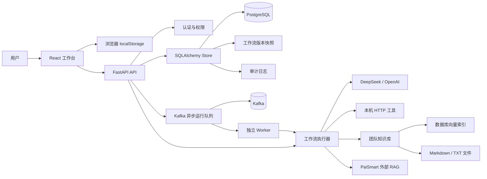
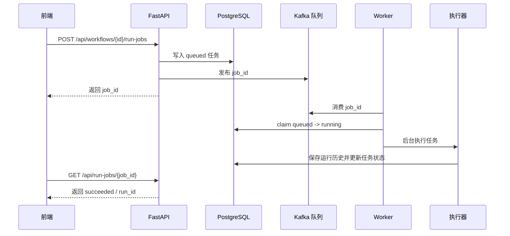
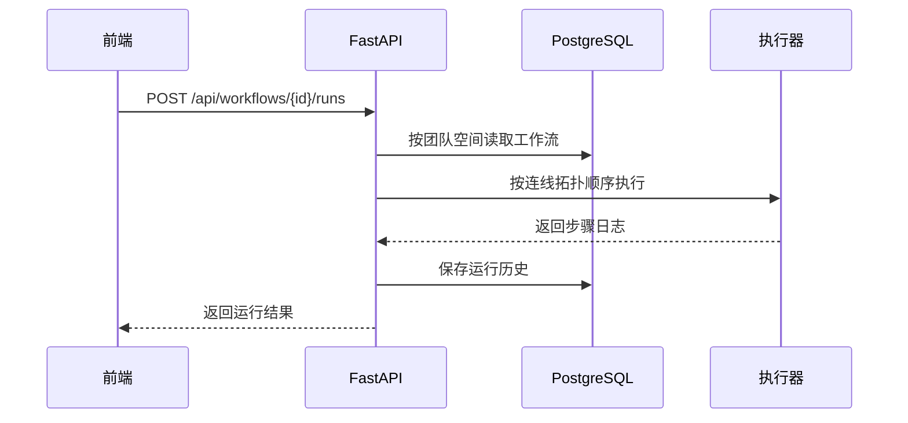

# 架构说明

## 总览

## 前端

- React + TypeScript + Vite。
- React Flow 负责画布、节点和连线。
- 管理中心的系统概览、运行历史和版本审计已拆为 `src/components/*Panel.tsx` 展示组件，`src/App.tsx` 保留主要状态和业务编排。
- `localStorage` 保存本地草稿、当前工作流和登录 token。
- 前端运行器支持变量传递、条件分支和模拟执行。
- 后端同步状态分为：仅本地、已同步、未同步改动。

## 后端

- FastAPI 提供 API。
- SQLAlchemy ORM 管理 `users`、`sessions`、`workspaces`、`workspace_members`、`workflows`、`workflow_versions`、`audit_logs`、`runs`、`run_jobs`、`knowledge_chunks`。
- `workflows` 保存草稿和发布状态，`workflow_versions` 保存历史快照并标记发布版本；发布不会覆盖历史，只会新增一个已发布快照。
- 版本对比基于 `workflow_versions` 中保存的节点和连线快照计算，不需要额外持久化 diff 结果。
- 运行成本统计基于每次运行保存的步骤 `kind`、`provider` 和重试次数计算估算成本单位，不依赖云厂商账单 API。
- Alembic 管理数据库迁移。
- Bearer Token 鉴权。
- 工作流、运行历史、知识库文件按团队空间隔离，并通过 owner/editor/viewer 角色控制读写。
- 工作流创建和更新会自动生成版本快照，也支持手动保存版本和恢复指定版本。
- 审计日志记录工作流、团队成员、模型配置和运行入队等关键操作，按团队空间查询。
- 团队空间可以保存 DeepSeek 模型配置；API Key 后端保护存储，前端只显示掩码，工作流运行时优先使用空间配置。
- 正式异步运行统一使用 Kafka。任务会先写入 `run_jobs` 表，再把 `job_id` 发布到 Kafka；自动化测试会临时使用 `thread`，避免测试环境依赖 Kafka。
- 队列任务会先写入 `run_jobs` 表。Worker 启动时会把未完成的 running 任务重新入队，避免服务重启后卡死。
- 知识库使用 Markdown/TXT 文件保存原文，同时在数据库中保存哈希向量索引，检索时混合关键词分和余弦相似度。
- 知识检索节点也可以选择 PaiSmart 外部 RAG，后端通过 `/api/v1/search/hybrid` 拉取检索片段；失败时回退本地知识库。

## 执行链路

同步运行仍保留：

## 数据隔离

- 每个账号有独立 `user_id`。
- 每个账号会自动创建默认团队空间。
- API 通过 `X-Workspace-Id` 选择空间；不传时使用默认空间。
- owner 可以管理成员，editor 可以编辑工作流和知识库，viewer 可以查看和运行。
- 工作流、运行历史、异步任务、知识库索引都绑定 `workspace_id`。

## 设计取舍

- 当前开发、测试和 Docker Compose 部署统一使用 PostgreSQL。
- 当前向量索引是本地哈希向量，优点是零额外依赖；生产可升级到真实 embedding + pgvector/Milvus。
- 当前正式异步链路统一走 Kafka；更大规模可以继续增加任务优先级、重试退避、死信队列和消费监控。
